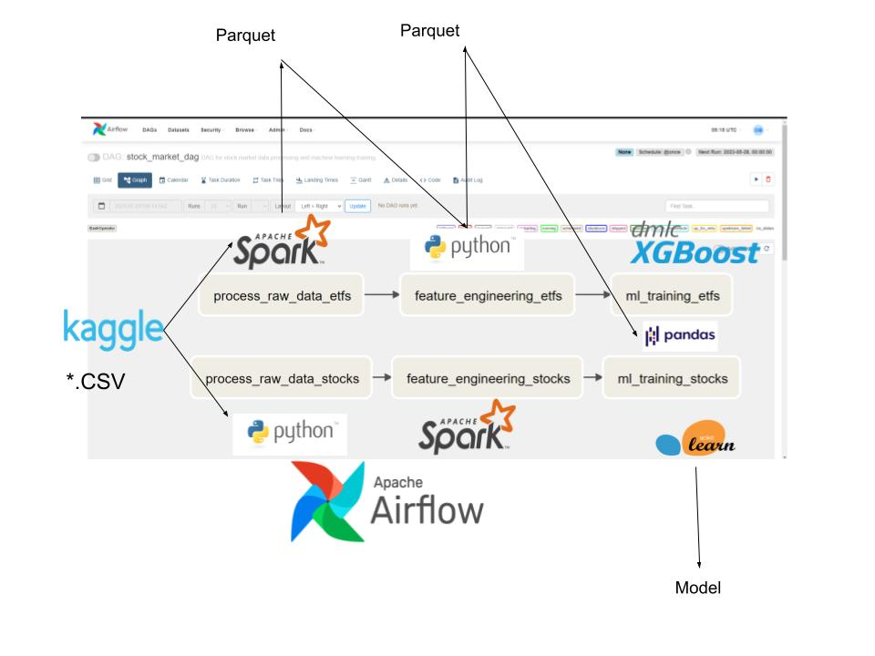

# Work Sample for Data Engineer: Stock Market Dataset
# Data Pipeline

This repository contains the solution for the data pipeline , which involves processing raw stock market datasets,feature engineering, integrating ML training, and building an API service for model serving.

## Project Structure

The project is structured as follows:

- `dags/`: Contains the Airflow DAG file `dag.py` that orchestrates the data pipeline tasks.
- `data/`: Contains subdirectories for raw and processed data.
  - `raw_data/`: Stores the downloaded raw stock market datasets.
  - `processed_data/`: Stores the processed data in the Parquet format.
- `logs/`: Stores log files generated during the pipeline execution.
- `model/`: Stores the trained ML models.
  - `modeletfs_1.0.pkl`: Trained model for ETFs.
  - `modelstocks_1.0.pkl`: Trained model for stocks.
- `src/`: Contains the source code files.
  - `feature_engineering.py`: Performs feature engineering on the processed data.
  - `load_data_from_kaggle.sh`: Shell script to download the raw data from Kaggle.
  - `ml_training.py`: Integrates ML training into the data pipeline.
  - `process_raw_data.py`: Processes the raw data and saves it in the Parquet format.
  - `test_feature_engineering.py`: Unit tests for the feature engineering logic.
- `requirements.txt`: Lists the Python dependencies required to run the project.
## Description
This project implements a data pipeline for processing raw stock market datasets, performing feature engineering, integrating ML training, and building an API service for model serving.

